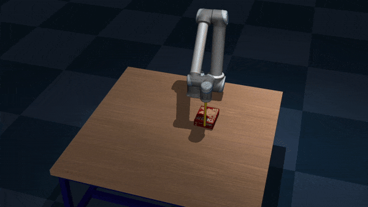

# ActivePusher: Active Learning and Planning with Residual Physics for Nonprehensile Manipulation

Implementation of paper "ActivePusher: Active Learning and Planning with Residual Physics for Nonprehensile Manipulation". This is a framework for robot to learn and plan real-world nonprehensile manipulation task efficiently.


<p align="center">
      <a href="https://www.youtube.com">
          
    </a>
</p>

## Dependencies

This project is developed and tested in Ubuntu 22.04 with python 3.10.

```bash
git clone --recurse-submodules git@github.com:elpis-lab/ActivePusher.git
```

#### Installation of required packages

Install pytorch following the instructions from [pytorch.org](https://pytorch.org/get-started/locally/).

Install OMPL python bindings with provided pre-built wheels in [OMPL Github Releases](https://github.com/ompl/ompl/releases). This project uses OMPL 1.7.0.

Install other requirements

```bash
pip install -r requirements.txt
```

If you want to run this with a real UR robot

```bash
pip install -r requirements_robot.txt
```

## Active Learning

### Simulation

In this project, we use [Mujoco](https://mujoco.org/) robotic simulation as it is one of the best physics simulators for contact-rich dynamic robotic tasks. You can visualize the enviroment setup by

```bash
python scripts/simulation/mujoco_sim.py 
```

### Data Collection

To collect push data of a given object, run

```bash
python scripts/collect_data.py <obj_name>
```

You will see the robot start to push the object randomly. The push parameter and the effect of the push will be recorded and saved in **data** folder.



### Run Active Training

After data collection, you can run the active learning pipeline with `train_active.py`.

```bash
python train_active.py <obj_name> <model_class> <n_exp> <n_query> <batch_size>
```

where `<obj_name>` is the name of the object to be trained (e.g. `cracker_box_flipped`), and `<model_class>` is the class of the model to be used, either `residual` or `mlp`. `<n_exp>` determines how many training repetition to run (for evaluation). `<n_query>` is the total number of training data to use and `<batch_size>` is the active learning batch size, which determines how frequent the model will run active learning strategy.

After training, all the models will be saved in **results/models** folder and all the historical data will be saved in **results/learning** folder.

You can plot the results by running `scripts/plot_active.py`. Here is the active learning result demonstrating how residual physics model and active learning method BAIT, can help to learn dynamics model efficiently. It only requiring approximately 40~50% of the data to reach the final performance of the baseline method.


## Active Planning

### Planning with Active Sampling

In this project we consider two nonprehensile pushing tasks. The first one is pushing to region (currently only support `mustard_bottle_flipped`), and the other one is pushing to the edge of the table to grasp, with obstacles present (currently only support `cracker_box_flipped`).

You can execute planning with

```bash
python planning_region.py <obj_name> <model_type> <learning_type> <n_data> <active_sampling>
```

```bash
python planning_edge.py <obj_name> <model_type> <learning_type> <n_data> <active_sampling>
```

where `<obj_name>` is the name of the object (e.g. `cracker_box_flipped`), `<model_type>` is the class of the model to be used, either `residual` or `mlp`, and `learning_type` is whether active learning strategy is used, either `regular` or `bait`. `n_data` is the number of data the model is trained with. Lastly, `active_sampling` is whether you want to plan this problem with active sampling methods. By default, this will try to solve 100 randomly sampled problems.

Since we can leverage the parallelization for planning, we also provide bash scripts to run them in parallel. You can find them in **scripts** folder.

### Run Plans

For simplicity, if you plan with pre-defined control list, the control list is a very large batch of control parameters from the dataset, which is NOT used for training the model. In this case, we can assume that the actual effect of these controls are the same as in dataset. We can therefore evaluate the plan using only the corresponding dataset values without running the simulation again.

To evaluate the plan in this manner

```bash
python scripts/run_plans_pool.py
```

To evaluate the plan with simulation

```bash
python scripts/run_plans.py
```

After planning, all the results will be saved in **results/planning** folder.

You can plot the results by running `scripts/plot_planning.py`. Here is the active planning result demonstrating how active sampling strategy biases the control sampler to sample more reliable actions, leading to a higher planning success rate.
